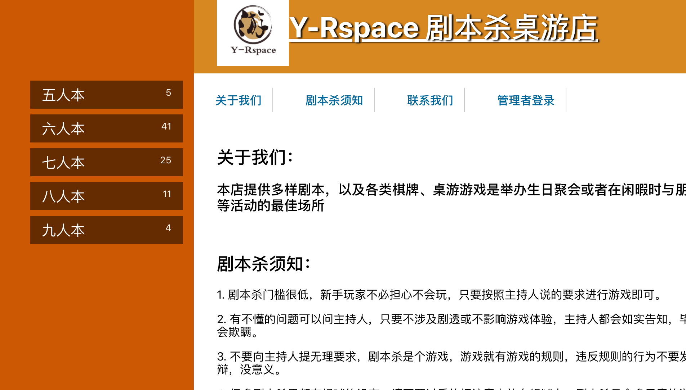
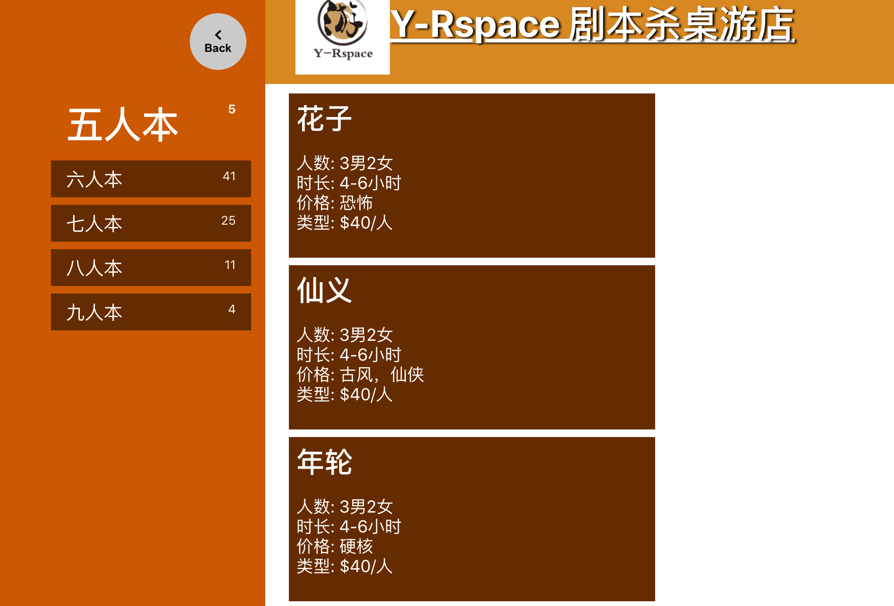
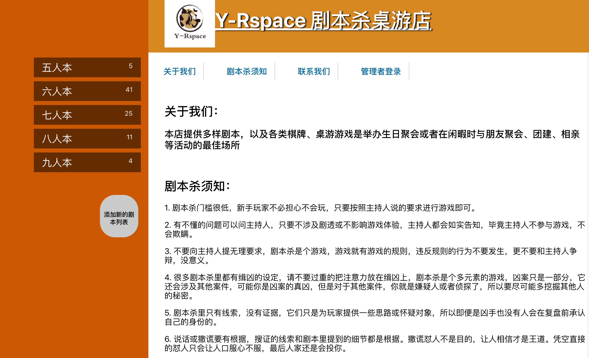
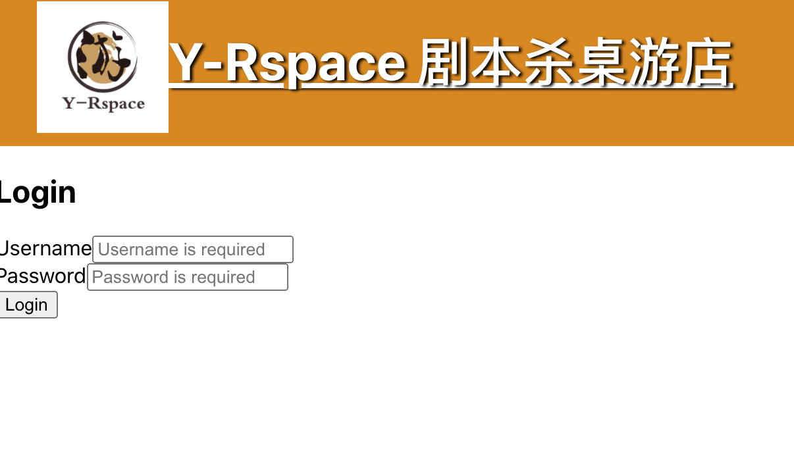
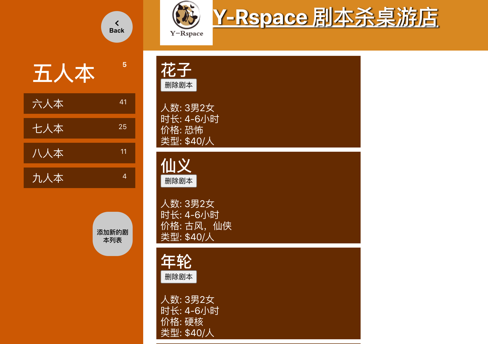

### Y-Rspace Server

* Live App: https://yrspace.vercel.app/
* Database URL: https://y-rspace.herokuapp.com/
* Client Repo: https://github.com/uimm258/Hongni-Capstone1-Client
* Server Repo: https://github.com/uimm258/Hongni-Capstone1-Server

### Stack Used

* Client: HTML, CSS, React.Js
* Server: Express and Node.Js

### User Stories
This app is for two types of users: a visitor and an admin

As a visitor:
* I want to see all the categories and scripts
* I want to see the store information
* I don't want to sign-up for the admin access

As an admin:
* I want to be able add/edit/delete categories/scripts
* I want to enter my password and username to log into this app
* I do not want to anyone else to have the admin access

### Screenshots without logins
* Homepage
:-------------------------:

* Category-page && Script-list-page
:-------------------------:

* Script-main-page
:-------------------------:

### Screenshots with logins
* Homepage
:-------------------------:

* Login page
:-------------------------:

* Category-page && Script-list-page
:-------------------------:

* Script-main-page
:-------------------------:

### Open Endpoints for Backend

* Get /category: display the entire data that's in the category table
* Get /scripts: display the entire data that's in the script table

Closed endpoints require a valid Token to be included in the header of the request. 
* Login: /admin
* Get: /admin/category 
    display general information
* Post: /admin/category
    add new categories to the existing table
* Post: /admin/scripts
    add new scripts to the existing table
* Delete: /admin/category: 
    remove the selected category
* Delete: /admin/scripts
    remove the selected script
